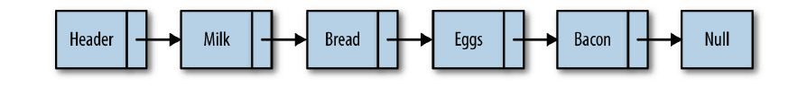
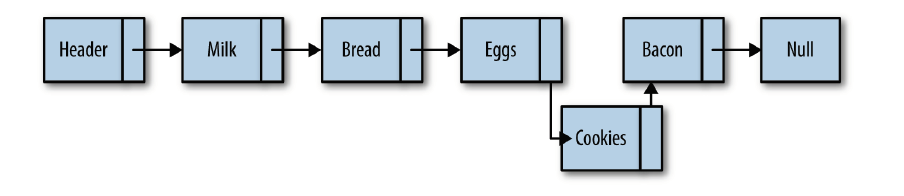
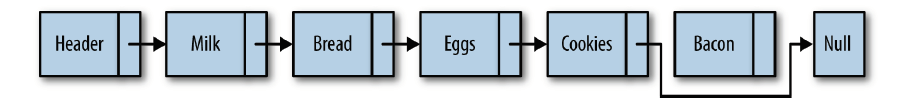

# 链表

## 数组的问题

在多数编程语言中，数组的长度是固定的。所以当数组已被数据填满时，插入新的元素就会非常困难。在数组中添加和删除元素也很麻烦，因为需要将数组中的其他元素向前或向后平移，以反映数组刚刚进行了添加或删除操作。

JavaScript中数组使用`split()`方法不需要访问数组中的其他对象。其主要问题是，它们被实现成了对象。与其他语言相比，效率很低。

## 定义链表

### 1. 单链表

链表是有一组**结点**组成的集合。每个结点都使用一个对象的引用指向它的后继。指向另一个结点的引用叫做**链**。

数组元素靠它们的位置进行引用，链表元素则是靠相互之间的关系进行引用。

遍历链表就是跟着链接，从链表的首元素走到尾元素(不包括链表的头结点，头结点常常用作链表的接入点)。

链表的尾元素指向`null`

#### 带有头节点的单链表

许多链表的实现在链表的最前面有一个特殊的节点，叫做头节点。

#### 插入节点

链表中插入一个节点的效率很高，向链表中插入一个结点，需要修改它前面结点(前驱结点)，使其指向新加入的结点，而新加入的结点则指向原来前驱结点指向的节点。

#### 删除节点

### 2. 双向链表

#### 定义

尽管从链表的头节点遍历到尾节点很简单，但从后向向前遍历则没有那么简单。

通过给`Node`对象增加一个属性，改属性存储指向前驱结点的的链接。

但是插入一个节点时，需要指出该节点正确的前驱和后继。但是在从链表中删除节点时，效率提高了，不需要再查找待删除节点的前驱节点了。缺点是增加了存储空间。

### 3. 循环链表

#### 定义

循环链表和单向链表类似，节点类型都是一样的。唯一的区别是，在创建循环链表时，让其头节点`next`属性指向它本身，即 `head.next = head`

#### 优点

如果希望从后向前遍历链表，但是又不想付出额外代价来创建一个双向链表，那么可以使用循环链表。从循环列表的尾节点向后移动，就等于从后向前遍历链表。

