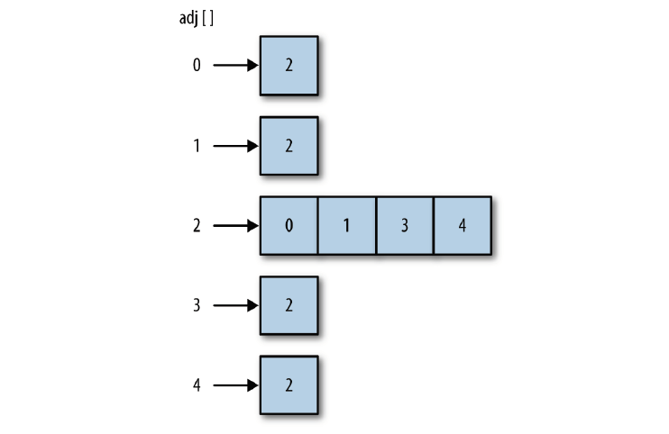

# 散列

> 散列是一种常用的数据存储技术，散列后的数据可以快速地插入或者取用。散列使用的数据结构叫做散列表。
> 在散列表上插入、删除和取用数据都非常快，但是对于查找操作来说却效率低下，比如查找一组数据中的最大值和最小值。这些操作得求助于其他数据结构。

## 概览

我们散列表的设计是基于数组的。数组的长度**预先设定**。

所有元素根据其对应的键，保存在数组的特定位置。

使用散列表存储数据时，**通过一个散列函数将键映射为一个数字**，这个数字的范围是0到散列表的长度。

理想情况下，**散列函数会将每个键值映射为一个唯一的数组索引**。然而，键的数量是无限的，数组的长度是有限的。一个更现实的目标是让散列函数尽量将键均匀地映射到数组中。

即使使用一个高效的散列函数，仍然存在将两个键映射成同一个值的可能，这种现象称为**碰撞**。

散列表中数组的大小：对数组大小常见的限制是：数组长度应该是一个质数。

### HashTable 类

#### 1. 选择一个散列函数

散列函数的选择一脸与键值的数据类型。

如果键是整型，最简单的散列函数就是**以数组的长度对键取余**。

对于一些情况，比如数组的长度是10，而键值都是10的倍数时，就不推荐使用上述方法了。这也是为什么数组的长度要为质数的原因之一。

如果键是随机的整数，则散列函数应该更均匀地分布这些键。这种散列方式称为**除留余数法**。

如果键是字符串类型，一个简单的办法是将字符串中每个字符的ASCII码值相加，散列值就是ASCII码之和除以数组长度的余数。

#### 2. 一个更好的散列函数

为了避免碰撞，首先要确保散列表中用来存储数据的数组的长度是个质数。

数组的长度应该在100以上，这是为了让数据在散列表中分布得更加均匀。

为了避免碰撞，在给散列表一个合适的大小后，接下来要有一个计算散列值的更好方法。

霍纳算法：先计算字符串中各字符的ASCII码值，不过求和时每次要乘以一个质数。

#### 3. 碰撞处理

当散列函数对于多个输入产生同样的输出时，就产生了碰撞。

##### 3.1 开链法 Separate Chaining

当碰撞发生时，我们仍然希望将键存储到通过散列算法产生的索引位置上，但是不可能将多份数据存储到一个数组单元中。

**开链法**是指实现散列表的底层数组中，每个数组元素又是一个新的数据结构，比如另一个数组，这样就能存储多个键了。

使用这种技术，即使两个键散列后的值相同，依然被保存在同样的位置，只不过他们在第二个数组中的位置不一样。

实现开链法的方法是：在创建存储散列过的键值的数组时，通过一个函数创建一个新的空数组，然后将该数组赋给散列表里的每个数组元素。这样就创建了一个二维数组，也称为链。

##### 3.2 线性探测法 Linear Probing

线性探测法属于一种更一般化的散列技术：开放寻址散列。

当发生碰撞时，线性探测法检查散列表中的下个位置是否为空。如果为空，就将数据存入该位置。如果不为空，则继续检查下一个位置，直到找到一个空的位置为止。

**该技术是基于这样一个事实：每个散列表都会有很多空的单元格，可以使用它们来存储数据。**

当存储数据使用的数组特别大时，选择线性探测法要比开链法好。选择的依据是：

> 如果数组的大小是待存储数据个数的1.5倍，那么使用开链法。
> 如果数组的大小是待存储数据的两倍及以上时，那么使用线性探测法。