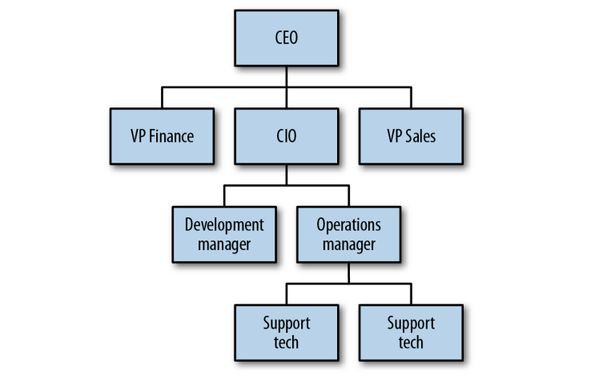
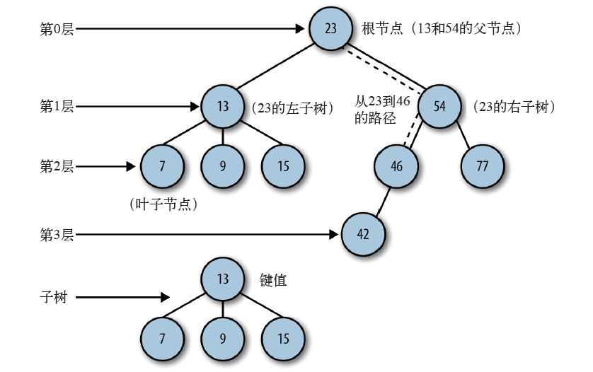
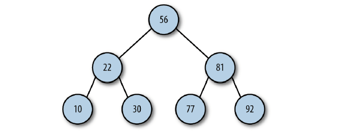

# 二叉树和二叉查找树

> 树是一种非线性的数据结构，以分层的方式存储数据。
>
> 树被用来存储具有层级关系的数据，比如文件系统中的文件。树还可以用来存储有序列表。
>
> 二叉树是一种特殊的树。选择树而不是那些基本的数据结构，是因为在二叉树上进行查找非常快（在链表上查找则不是这样），同时为二叉树添加或删除元素也非常快（对数组执行添加或者删除操作则不是这样）。

## 树的定义

树是由一组**以边连接的结点**组成。公司的组织结构图（organization chart）就是一个树的例子：每个方框都是一个结点，连接方框的线叫做**边**。**结点**代表了该组织中的各个职位，**边**描述了各个职位之间的关系。

### 与树相关的术语

一棵树最上面的节点称为**根节点**。

如果一个节点下面连接多个节点，那么该节点称为**父节点**，它下面的节点称为**子节点**。

一个节点可以有**0个、1个或多个**子节点。

没有任何子节点的节点称为**叶子节点**。

沿着一组特定的边，可以从一个节点走到另外一个与它不直接相连的节点。从一个节点到另一个节点的这一组边称为**路径**。

以某种特定顺序访问树中所有的节点称为**树的遍历**。

树可以分为几个层次，根节点是第0层，它的子节点是第一层，子节点的子节点是第二层，以此类推。我们定义**树的层次**就是树的**深度**。

每个结点都有一个与之相关的值，该值有时候被称为**键**。

### 二叉树和二叉查找树

#### 二叉树

二叉树**每个节点**的**子节点不允许超过两个**。

通过将子节点的个数限定为2，可以写出高效的程序在树中插入、查找和删除数据。

一个父节点的两个子节点分别称为**左节点**和**右节点**。

#### 二叉查找树

当考虑某种特殊的二叉树，比如二叉查找树时，确定子节点非常重要。

二叉查找树是一种特殊的二叉树，**相对较小的值保存在左节点中，较大的值保存在右节点中**。

这一特性使得查找的效率很高，对于数值和非数值型的数据都是如此。